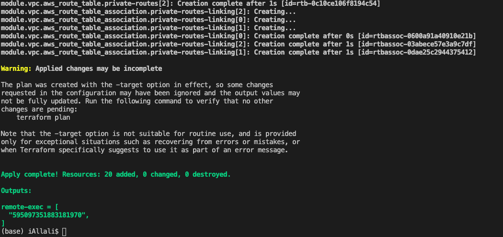
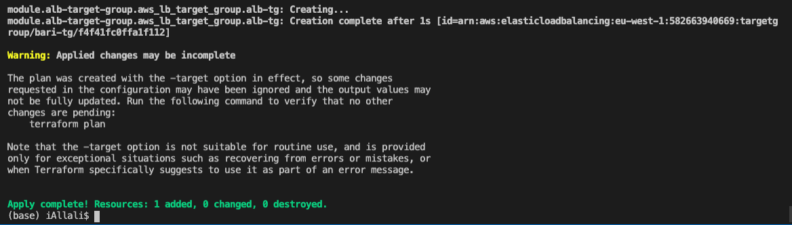
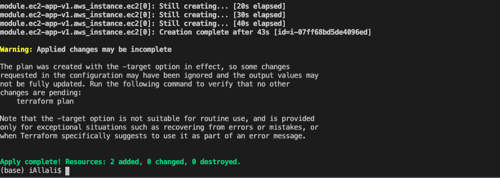
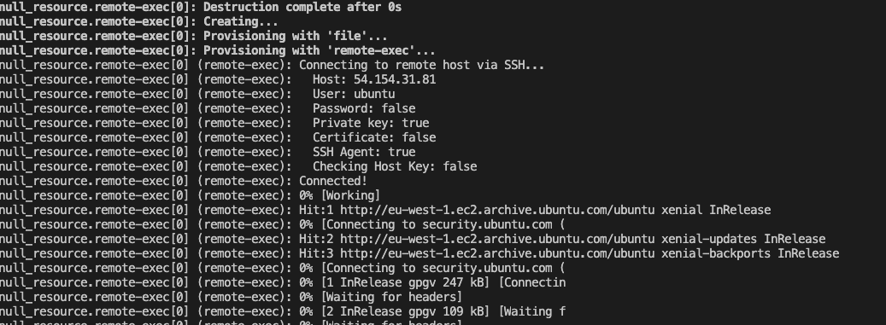

## Using Terraform to lauch a Loadbalanced web app

#### 1. Prerequisites

- Set up an AMI with ssh key connection

`ssh-keygen -t rsa`

`send the public key to the instance with the following command:

cat ~/.ssh/id_rsa.pub | ssh user@123.45.56.78 "mkdir -p ~/.ssh && cat >>  ~/.ssh/authorized_keys"`

- Put the private key in the `bari-terraform-v2.pub file`
*** Be sure not to upload these to Github ***

#### 2. Launching the VPC

- `terraform init`
- `terraform plan -target=module.vpc`
- `terraform apply -target=module.vpc`




#### 3. Launch the Target Groups

- `terraform plan -target=module.alb-target-group`
- `terraform apply -target=module.alb-target-group`




#### 4. Launching Loadbalancer *** THIS STAGE CAN BE DONE LAST ***

- Make sure you copy the `ARN` once the target-groups are created and the copy this into the following file

`application-lb-module.tf`

*** for this stage, please have a valid `certificate-arn` too

- launch the Load-balancer with the following commands

- `terraform plan -target=module.app-alb`
- `terraform apply -target=module.app-alb`

#### 5. Set up the Security Groups for EC2s

*** Ensure to update the Inbound rule to your IP address in the following file
`ec2-sg-module.tf`
`RULE-3-INBOUND-RULES`

- `terraform plan -target=module.bari-ec2.sg`
- `terraform apply -target=module.bari-ec2-sg`

#### 6. Setting up EC2s

- Update the subnet id in the following file
`ec2-app-v1`
- go to line 18 and update the subnet id from your aws dashboard
- In this file you can customise the settings of your deployment

*** Ensure you have placed your private key generated earlier as they will be used to ssh into the instances created ***

- `terraform plan -target=module.ec2-app-v1`
- `terraform apply -target=module.ec2-app-v1`




#### 7. Provisioning EC2s

- before running this command, you need update the host variable in the following file:
- `remote-exec-provisioner.tf`
- you need to update it with the public ip of the newly created ec2 instance

- `terraform plan -target null_resource.remote-exec`
- `terraform apply -target null_resource.remote-exec`




#### Destroying Resources

```
terraform destroy -target module.app-alb
terraform destroy -target=module.ec2-app-v1
terraform destroy -target=module.bari-ec2-sg
terraform destroy -target=module.alb-target
terraform destroy -target=module.vpc

```
